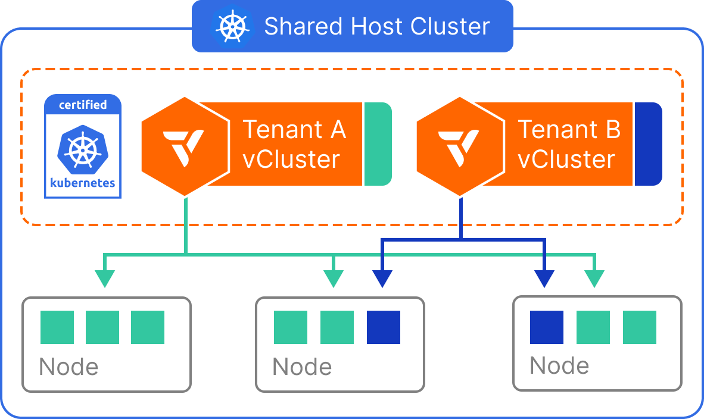
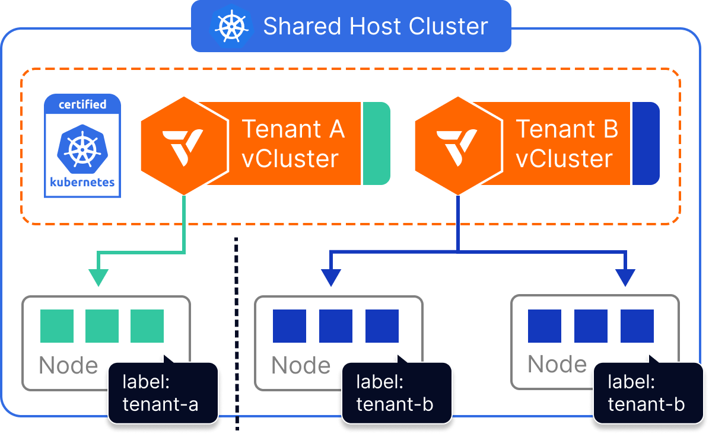
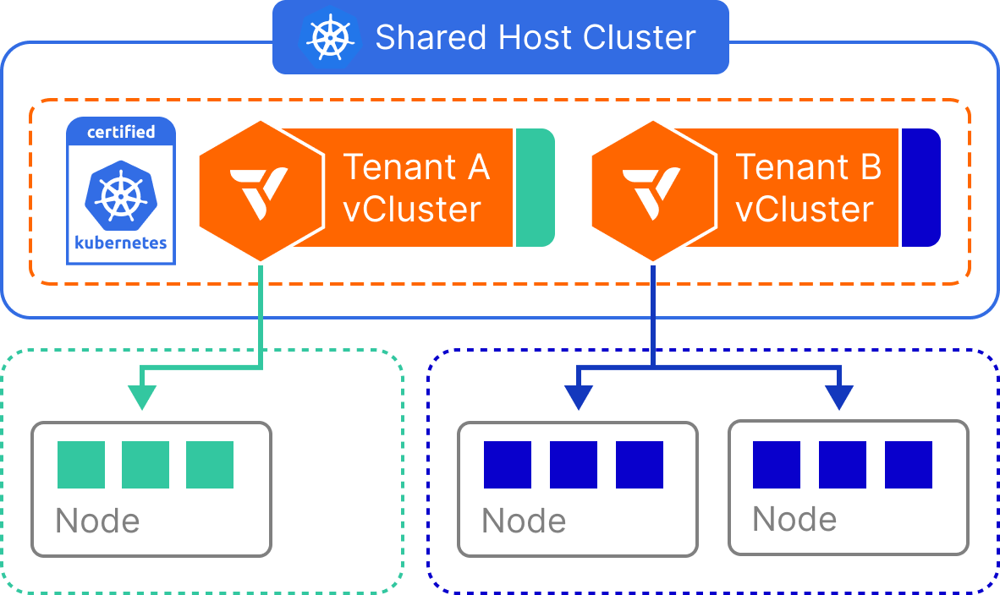
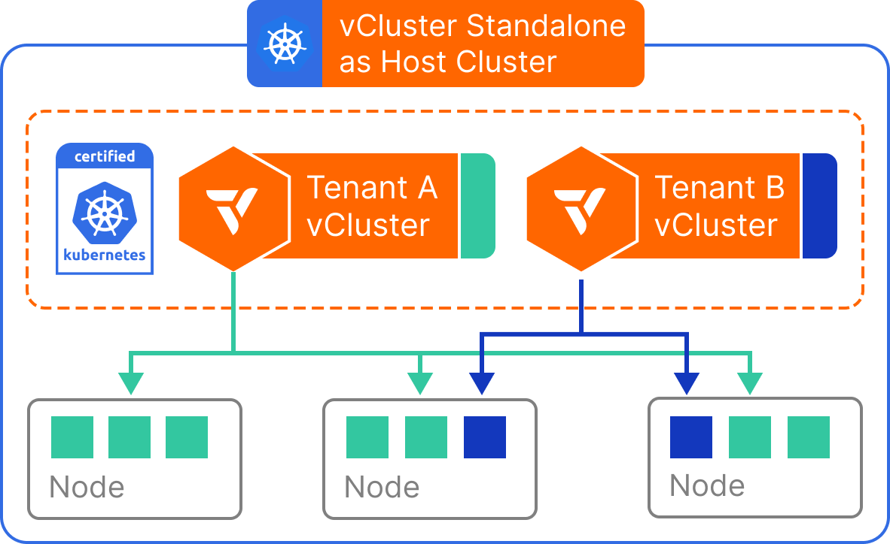
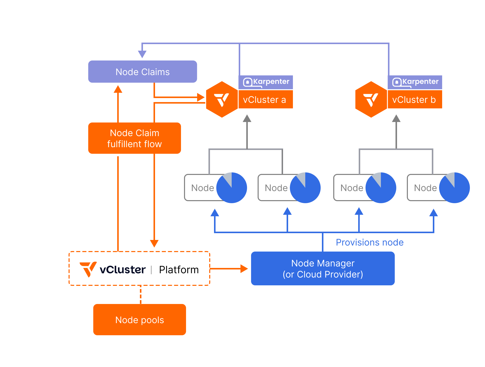

<div align="center">
  <a href="https://www.vcluster.com">
    <picture>
      <source media="(prefers-color-scheme: dark)" srcset="docs/static/media/vcluster_horizontal_orange_white.svg">
      <source media="(prefers-color-scheme: light)" srcset="docs/static/media/vcluster_horizontal_orange_black.svg">
      
    </picture>
  </a>
  <p><strong>Flexible Tenancy For Kubernetes and AI Infra</strong></p>

[](https://github.com/loft-sh/vcluster/stargazers)
[](https://slack.loft.sh/)
[](https://www.linkedin.com/company/vcluster)
[](https://x.com/loft_sh)

**[Website](https://www.vcluster.com)** • **[Quickstart](https://www.vcluster.com/docs/get-started/)** • **[Documentation](https://www.vcluster.com/docs/vcluster/introduction/what-are-virtual-clusters)** • **[Blog](https://loft.sh/blog)** • **[Slack](https://slack.loft.sh/)**

</div>

---

## What is vCluster?

**vCluster** creates fully functional virtual Kubernetes clusters that run inside namespaces of a host cluster. Each virtual cluster has its own API server, runs on shared or dedicated infrastructure, and gives you flexible tenancy options—from simple namespaces to fully dedicated clusters.

**40M+ virtual clusters deployed** by companies like Adobe, CoreWeave, Atlan, and NVIDIA.

<div align="center">


</div>

---

## 🚀 Quick Start

```bash
# Install vCluster CLI
brew install loft-sh/tap/vcluster

# Create a virtual cluster
vcluster create my-vcluster --namespace team-x

# Use kubectl as usual - you're now in your virtual cluster!
kubectl get namespaces
```

**Prerequisites:** A running Kubernetes cluster and `kubectl` configured.

👉 **[Full Quickstart Guide](https://www.vcluster.com/docs/get-started)**

### 🎮 Try Without Installing

No Kubernetes cluster? Try vCluster instantly in your browser:

[](https://killercoda.com/vcluster)

---

## 🆕 What's New

| Version | Feature | Description |
|---------|---------|-------------|
| **v0.30** | [vCluster VPN & Netris Integration](https://www.vcluster.com/releases/en/changelog/platform-v45-and-vcluster-v030-secure-cloud-bursting-on-prem) | Tailscale-powered overlay network and automated network isolation for hybrid infrastructures |
| **v0.29** | [Standalone Mode](https://www.vcluster.com/docs/vcluster/deploy/control-plane/binary/) | Run vCluster without a host cluster—directly on bare metal or VMs |
| **v0.28** | [Auto Nodes](https://www.vcluster.com/docs/vcluster/deploy/worker-nodes/private-nodes/auto-nodes/) | Karpenter-powered dynamic autoscaling for private nodes |
| **v0.27** | [Private Nodes](https://www.vcluster.com/docs/vcluster/deploy/worker-nodes/private-nodes) | External nodes with full CNI/CSI isolation |
| **v0.26** | [Hybrid Scheduling & Namespace Syncing](https://www.vcluster.com/releases/en/changelog/vcluster-v026-namespace-syncing-and-hybrid-scheduling) | Multiple scheduler support for AI/ML workloads and fine-grained namespace synchronization |

👉 **[Full Changelog](https://www.vcluster.com/releases)**

---

## 🎯 Use Cases

| Use Case | Description | Learn More |
|----------|-------------|------------|
| **GPU Cloud Providers** | Launch managed K8s for GPUs. Give customers isolated, production-grade Kubernetes fast. | [View →](https://www.vcluster.com/solutions/gpu-cloud-providers) |
| **Internal GPU Platform** | Maximize GPU utilization without sacrificing isolation. Self-service access for AI/ML teams. | [View →](https://www.vcluster.com/solutions/internal-gpu-platform) |
| **AI Factory** | Run AI on-prem where your data lives. Multi-tenant K8s for training, fine-tuning, inference. | [View →](https://www.vcluster.com/solutions/ai-factory) |
| **Bare Metal K8s** | Run Kubernetes on bare metal with zero VMs. Isolation without expensive overhead. | [View →](https://www.vcluster.com/solutions/bare-metal-kubernetes) |
| **Software Vendors** | Ship Kubernetes-native software. Each customer gets their own isolated virtual cluster. | [View →](https://www.vcluster.com/solutions/software-vendors) |
| **Cost Savings** | Cut Kubernetes costs by consolidating clusters. Sleep mode pauses inactive clusters. | [View →](https://www.vcluster.com/cost-savings) |

---

## 🏗️ Architectures

vCluster offers multiple deployment architectures. Each builds on the previous, offering progressively more isolation.

### Architecture Comparison

| | **Shared Nodes** | **Dedicated Nodes** | **Private Nodes** | **Standalone** |
|---|:---:|:---:|:---:|:---:|
| **Host Cluster** | Required | Required | Required | Not Required |
| **Node Isolation** | ❌ | ✅ | ✅ | ✅ |
| **CNI/CSI Isolation** | ❌ | ❌ | ✅ | ✅ |
| **Best For** | Dev/test, cost | Production | Compliance, GPU | Bare metal, edge |

👉 **[Full Architecture Guide](https://www.vcluster.com/docs/vcluster/introduction/architecture/)**

### Minimal Configuration

<details>
<summary>🔹 Shared Nodes — Maximum density, minimum cost</summary>
Virtual clusters share the host cluster's nodes. Workloads run as regular pods in a namespace.
<div align="center">

</div>

```yaml
sync:
  fromHost:
    nodes:
      enabled: false  # Uses pseudo nodes
```
</details>
<details>
<summary>🔹 Dedicated Nodes — Isolated compute on labeled node pools</summary>
Virtual clusters get their own set of labeled host nodes. Workloads are isolated but still managed by the host.
<div align="center">

</div>

```yaml
sync:
  fromHost:
    nodes:
      enabled: true
      selector:
        labels:
          tenant: my-tenant
```
</details>
<details>
<summary>🔹 Private Nodes <sup>v0.27+</sup> — Full CNI/CSI isolation</summary>
External nodes join the virtual cluster directly with their own CNI, CSI, and networking stack. Complete workload isolation from the host cluster.
<div align="center">

</div>

```yaml
privateNodes:
  enabled: true
controlPlane:
  service:
    spec:
      type: NodePort
```
</details>
<details>
<summary>🔹 vCluster Standalone <sup>v0.29+</sup> — No host cluster required</summary>
Run vCluster without any host cluster. Deploy the control plane directly on bare metal or VMs. The highest level of isolation—vCluster becomes the cluster.
<div align="center">

</div>

```yaml
controlPlane:
  standalone:
    enabled: true
    joinNode:
      enabled: true
privateNodes:
  enabled: true
```
</details>
<details>
<summary>⚡ Auto Nodes <sup>v0.28+</sup> — Karpenter-powered dynamic autoscaling</summary>
Automatically provision and deprovision private nodes based on workload demand. Works across public cloud, private cloud, hybrid, and bare metal environments.
<div align="center">

</div>

```yaml
autoNodes:
  enabled: true
  nodeProvider: <provider>
privateNodes:
  enabled: true
```
</details>

---

## ✨ Key Features

| Feature | Description |
|---------|-------------|
| **🎛️ Isolated Control Plane** | Each vCluster gets its own API server, controller manager, and data store—complete Kubernetes API isolation |
| **🔗 Shared Platform Stack** | Leverage the host cluster's CNI, CSI, ingress, and other infrastructure—no duplicate platform components |
| **🔒 Security & Multi-Tenancy** | Tenants get admin access inside their vCluster while having minimal permissions on the host cluster |
| **🔄 Resource Syncing** | Bidirectional sync of any Kubernetes resource. Pods, services, secrets, configmaps, CRDs, and more |
| **💤 Sleep Mode** | Pause inactive virtual clusters to save resources. Instant wake when needed |
| **🔌 Integrations** | Native support for cert-manager, external-secrets, KubeVirt, Istio, and metrics-server |
| **📊 High Availability** | Multiple replicas with leader election. Embedded etcd or external databases (PostgreSQL, MySQL, RDS) |

---

## 🏢 Trusted By

<table>
<tr>
<td align="center"><a href="https://www.vcluster.com/case-studies/atlan"><strong>Atlan</strong></a><br/>100 → 1 clusters</td>
<td align="center"><a href="https://www.vcluster.com/case-studies/aussie-broadband"><strong>Aussie Broadband</strong></a><br/>99% faster provisioning</td>
<td align="center"><a href="https://www.vcluster.com/case-studies/coreweave"><strong>CoreWeave</strong></a><br/>GPU cloud at scale</td>
</tr>
<tr>
<td align="center"><a href="https://www.vcluster.com/case-studies/lintasarta"><strong>Lintasarta</strong></a><br/>170+ virtual clusters in prod</td>
<td align="center"><a href="https://www.vcluster.com/case-studies/fortune-500-insurance-company"><strong>Fortune 500 Insurance Company</strong></a><br/>70% reduction in Kubernetes cost</td>
<td align="center"><a href="https://www.vcluster.com/case-studies/scanmetrix"><strong>Scanmetrix</strong></a><br/>99% faster deployments</td>
</tr>
<tr>
<td align="center"><a href="https://www.vcluster.com/case-studies/deloitte"><strong>Deloitte</strong></a><br/>Enterprise K8s platform</td>
<td align="center"><a href="https://www.vcluster.com/case-studies/ada-cx"><strong>Ada</strong></a><br/>10x Developer Productivity</td>
<td align="center"><a href="https://www.vcluster.com/case-studies/trade-connectors"><strong>Trade Connectors</strong></a><br/>50% reduction in K8s ops cost</td>
</tr>
</table>

**Also used by:** NVIDIA, ABBYY, Lintasarta, Precisely, Shipwire, Trade Connectors, and many more.

👉 **[View All Case Studies](https://www.vcluster.com/case-studies)**

---

## 📚 Learn More

<details>
<summary><strong>🎤 Conference Talks</strong></summary>

| Event | Speaker | Title | Link |
|-------|---------|-------|------|
| KubeCon NA 2025 (Keynote) | Lukas Gentele | Autoscaling GPU Clusters Anywhere — Hyperscalers, Neoclouds & Baremetal | [Watch](https://www.youtube.com/watch?v=LGOELO-ah30) |
| Platform Engineering Day NA 2025 (Keynote) | Saiyam Pathak | AI-Ready Platforms: Scaling Teams Without Scaling Costs | [Watch](https://www.youtube.com/watch?v=sn5kIBS9Xfg) |
| Rejekts NA 2025 | Hrittik Roy, Saiyam Pathak | Beyond the Default Scheduler: Navigating GPU MultiTenancy in AI Era | [Watch](https://www.youtube.com/watch?v=tROp-nmNYxo) |
| KubeCon EU 2025 | Paco Xu, Saiyam Pathak | A Huge Cluster or Multi-Clusters? Identifying the Bottleneck | [Watch](https://www.youtube.com/watch?v=6l5zCt5QsdY) |
| HashiConf 2025 | Scott McAllister | GPU sharing done right: Secrets, security, and scaling with Vault and vCluster | [Watch](https://www.youtube.com/watch?v=zWx17azSqyU) |
| FOSDEM 2025 | Hrittik Roy, Saiyam Pathak | Accelerating CI Pipelines: Rapid Kubernetes Testing with vCluster | [Watch](https://archive.fosdem.org/2025/schedule/event/fosdem-2025-5569-accelerating-ci-pipelines-rapid-kubernetes-testing-with-vcluster/) |
| KubeCon India 2024 (Keynote) | Saiyam Pathak | From Outage To Observability: Lessons From a Kubernetes Meltdown | [Watch](https://www.youtube.com/watch?v=7JCZ688cWpY) |
| CNCF Book Club 2024 | Marc Boorshtein | Kubernetes - An Enterprise Guide (vCluster) | [Watch](https://www.youtube.com/watch?v=8vwnDlkkuJM) |
| KCD NYC 2024 | Lukas Gentele | Tenant Autonomy & Isolation In Multi-Tenant Kubernetes Clusters | [Watch](https://www.youtube.com/watch?v=AKJVLbXsUmE) |
| KubeCon EU 2023 | Ilia Medvedev, Kostis Kapelonis | How We Securely Scaled Multi-Tenancy with VCluster, Crossplane, and Argo CD | [Watch](https://www.youtube.com/watch?v=hFiHU6W4_z0) |
| KubeCon NA 2022 | Joseph Sandoval, Dan Garfield | How Adobe Planned For Scale With Argo CD, Cluster API, And VCluster | [Watch](https://www.youtube.com/watch?v=p8BluR5WT5w) |
| KubeCon NA 2022 | Whitney Lee, Mauricio Salatino | What a RUSH! Let's Deploy Straight to Production! | [Watch](https://www.youtube.com/watch?v=eJG7uIU9NpM) |
| TGI Kubernetes 2022 | TGI | TGI Kubernetes 188: vCluster | [Watch](https://www.youtube.com/watch?v=EaoxUDGpARE) |
| Mirantis Tech Talks 2022 | Mirantis | Multi-tenancy & Isolation using Virtual Clusters (vCluster) in K8s | [Watch](https://www.youtube.com/watch?v=CoqRXdJbCwY) |
| Solo Webinar 2022 | Rich Burroughs, Fabian Keller | Speed your Istio development environment with vCluster | [Watch](https://www.youtube.com/watch?v=b7OkYjvLf4Y) |
| KubeCon NA 2021 | Lukas Gentele | Beyond Namespaces: Virtual Clusters are the Future of Multi-Tenancy | [Watch](https://www.youtube.com/watch?v=QddWNqchD9I) |

</details>

<details>
<summary><strong>🎬 Community Voice</strong></summary>

| Channel | Speaker | Title | Link |
|---------|---------|-------|------|
| TeKanAid 2024 | TeKanAid | Getting Started with vCluster: Build Your IDP with Backstage, Crossplane, and ArgoCD | [Watch](https://www.youtube.com/watch?v=nIxl2PcEs-0) |
| Rawkode 2021 | David McKay, Lukas Gentele | Hands on Introduction to vCluster | [Watch](https://www.youtube.com/watch?v=IMdMvn2_LeI) |
| Kubesimplify 2021 | Saiyam Pathak, Lukas Gentele | Let's Learn vCluster | [Watch](https://www.youtube.com/watch?v=I4mztvnRCjs) |
| TechWorld with Nana 2021 | Nana | Build your Self-Service Kubernetes Platform with Virtual Clusters | [Watch](https://www.youtube.com/watch?v=tt7hope6zU0) |
| DevOps Toolkit 2021 | Viktor Farcic | How To Create Virtual Kubernetes Clusters | [Watch](https://www.youtube.com/watch?v=JqBjpvp268Y) |

</details>

👉 **[YouTube Channel](https://www.youtube.com/@vcluster)** • **[Blog](https://loft.sh/blog)**

---

## 🤝 Contributing

We welcome contributions! Check out our **[Contributing Guide](https://github.com/loft-sh/vcluster/blob/main/CONTRIBUTING.md)** to get started.

---

## 🔗 Links

| Resource | Link |
|----------|------|
| 📖 Documentation | [vcluster.com/docs](https://www.vcluster.com/docs/vcluster/introduction/what-are-virtual-clusters) |
| 💬 Slack Community | [slack.loft.sh](https://slack.loft.sh/) |
| 🌐 Website | [vcluster.com](https://www.vcluster.com) |
| 🐦 X (Twitter) | [@vcluster](https://x.com/vcluster) |
| 💼 LinkedIn | [vCluster](https://www.linkedin.com/company/vcluster) |
| 💬 Chat with Expert | [Start Chat](https://start-chat.com/slack/Loft-Labs/NnQl1M) |

---

## 📜 License

vCluster is licensed under the **[Apache 2.0 License](http://www.apache.org/licenses/LICENSE-2.0)**.

---

<div align="center">

**© 2026 [Loft Labs](https://loft.sh). All rights reserved.**

Made with ❤️ by the vCluster community.

⭐ **Star us on GitHub** — it helps!

</div>
