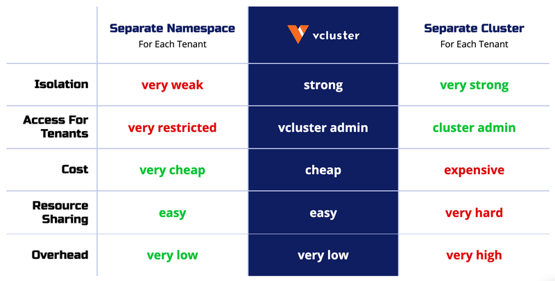

<br>
<a href="https://www.vcluster.com"></a>

### **[Website](https://www.vcluster.com)** • **[Quickstart](https://www.vcluster.com/docs/getting-started/setup)** • **[Documentation](https://www.vcluster.com/docs/what-are-virtual-clusters)** • **[Blog](https://loft.sh/blog)** • **[Twitter](https://twitter.com/loft_sh)** • **[Slack](https://slack.loft.sh/)**


[](https://slack.loft.sh/)

Create fully functional virtual Kubernetes clusters - Each vcluster runs inside a namespace of the underlying k8s cluster. It's cheaper than creating separate full-blown clusters and it offers better multi-tenancy and isolation than regular namespaces.

### Why Virtual Kubernetes Clusters?

- **Cluster Scoped Resources**: much more powerful than simple namespaces (virtual clusters allow users to use CRDs, namespaces, cluster roles etc.)
- **Ease of Use**: usable in any Kubernetes cluster and created in seconds either via a single command or [cluster-api](https://github.com/loft-sh/cluster-api-provider-vcluster)
- **Cost Efficient**: much cheaper and efficient than "real" clusters (single pod and shared resources just like for namespaces)
- **Lightweight**: built upon the ultra-fast k3s distribution with minimal overhead per virtual cluster (other distributions work as well)
- **Strict isolation**: complete separate Kubernetes control plane and access point for each vcluster while still being able to share certain services of the underlying host cluster
- **Cluster Wide Permissions**: allow users to install apps which require cluster-wide permissions while being limited to actually just one namespace within the host cluster
- **Great for Testing**: allow you to test different Kubernetes versions inside a single host cluster which may have a different version than the virtual clusters

Learn more on [www.vcluster.com](https://vcluster.com).

<br>




Learn more in the [documentation](https://vcluster.com/docs/what-are-virtual-clusters).

<br>

<p align="center">
⭐️ <strong>Do you like vcluster? Support the project with a star</strong> ⭐️
</p>

<br>

### Features

- **Certified Kubernetes Distribution** - vcluster itself is a [certified Kubernetes distribution](https://www.cncf.io/certification/software-conformance/) and is 100% Kubernetes API conform. Everything that works in a regular Kubernetes cluster works in vcluster
- **Lightweight & Low-Overhead** - Based on k3s, bundled in a single pod and with super-low resource consumption. Other distributions such as k0s or vanilla k8s are also supported
- **No Performance Degradation** - Pods are scheduled in the underlying host cluster, so they get no performance hit at all while running
- **Reduced Overhead On Host Cluster** - Split up large multi-tenant clusters into smaller vclusters to reduce complexity and increase scalability. Since most vcluster api requests and objects will not reach the host cluster at all, vcluster can greatly decrease pressure on the underlying Kubernetes cluster
- **Easy Provisioning** - Create via vcluster CLI, helm, kubectl, [cluster api](https://github.com/loft-sh/cluster-api-provider-vcluster), Argo CD or any of your favorite tools (it is basically just a StatefulSet)
- **No Admin Privileges Required** - If you can deploy a web app to a Kubernetes namespace, you will be able to deploy a vcluster as well
- **Single Namespace Encapsulation** - Every vcluster and all of its workloads are inside a single namespace of the underlying host cluster
- **Easy Cleanup** - Delete the host namespace and the vcluster plus all of its workloads will be gone immediately
- **Flexible & Versatile** - vcluster supports different storage backends (such as sqlite, mysql, postgresql & etcd), plugins, customizable sync behaviour, vcluster within vcluster setups and has many more additional configuration options to fit a multitude of different use cases

<br>

## Quick Start (~ 1 minute)

To learn more about vcluster, [**open the full getting started guide**](https://www.vcluster.com/docs/getting-started/setup).

### 1. Download vcluster CLI

Use one of the following commands to download the vcluster CLI binary from GitHub:

<details>
<summary>Mac (Intel/AMD)</summary>

```bash
curl -L -o vcluster "https://github.com/loft-sh/vcluster/releases/latest/download/vcluster-darwin-amd64" && sudo install -c -m 0755 vcluster /usr/local/bin
```

</details>

<details>
<summary>Mac (Silicon/ARM)</summary>

```bash
curl -L -o vcluster "https://github.com/loft-sh/vcluster/releases/latest/download/vcluster-darwin-arm64" && sudo install -c -m 0755 vcluster /usr/local/bin
```

</details>

<details>
<summary>Linux (AMD)</summary>

```bash
curl -L -o vcluster "https://github.com/loft-sh/vcluster/releases/latest/download/vcluster-linux-amd64" && sudo install -c -m 0755 vcluster /usr/local/bin
```

</details>

<details>
<summary>Linux (ARM)</summary>

```bash
curl -L -o vcluster "https://github.com/loft-sh/vcluster/releases/latest/download/vcluster-linux-arm64" && sudo install -c -m 0755 vcluster /usr/local/bin
```

</details>

<details>
<summary>Windows (Powershell)</summary>

```bash
md -Force "$Env:APPDATA\vcluster"; [System.Net.ServicePointManager]::SecurityProtocol = [System.Net.SecurityProtocolType]'Tls,Tls11,Tls12';
Invoke-WebRequest -URI "https://github.com/loft-sh/vcluster/releases/latest/download/vcluster-windows-amd64.exe" -o $Env:APPDATA\vcluster\vcluster.exe;
$env:Path += ";" + $Env:APPDATA + "\vcluster";
[Environment]::SetEnvironmentVariable("Path", $env:Path, [System.EnvironmentVariableTarget]::User);
```

> If you get the error that Windows cannot find vcluster after installing it, you will need to restart your computer, so that the changes to the `PATH` variable will be applied.

</details>

<br>

Alternatively, you can download the binary for your platform from the [GitHub Releases](https://github.com/loft-sh/vcluster/releases) page and add this binary to your PATH.

<br>

### 2. Create a vcluster

```vash
vcluster create my-vcluster

# OR: Use --expose to create a vcluster with an externally accessible LoadBalancer
vcluster create my-vcluster --expose

# OR: Use --isolate to create an isolated environment for the vcluster workloads
vcluster create my-vcluster --isolate
```

Take a look at the [vcluster docs](https://www.vcluster.com/docs/getting-started/deployment) to see how to deploy a vcluster using Helm or Kubectl instead.

### 3. Use the vcluster

Run in a terminal:

```bash
# Run any kubectl, helm, etc. command in your vcluster
kubectl get namespace
kubectl get pods -n kube-system
kubectl create namespace demo-nginx
kubectl create deployment nginx-deployment -n demo-nginx --image=nginx
kubectl get pods -n demo-nginx
```

### 4. Cleanup

```bash
vcluster delete my-vcluster
```

Alternatively, you could also delete the host-namespace using kubectl.

## Architecture

[](https://www.vcluster.com)

## Contributing

Thank you for your interest in contributing! Please refer to
[CONTRIBUTING.md](https://github.com/loft-sh/vcluster/blob/main/CONTRIBUTING.md) for guidance.

<br>

---

This project is open-source and licensed under Apache 2.0, so you can use it in any private or commercial projects.
