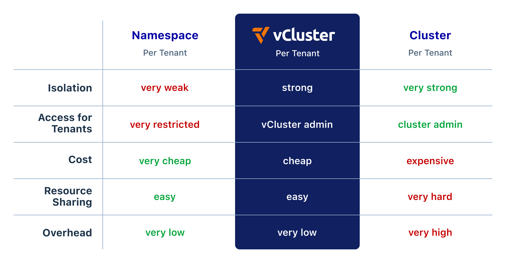

 

### **[Website](https://www.vcluster.com)** • **[Quickstart](https://www.vcluster.com/docs/get-started/)** • **[Documentation](https://www.vcluster.com/docs/what-are-virtual-clusters)** • **[Blog](https://loft.sh/blog)** • **[Twitter](https://twitter.com/loft_sh)** • **[Slack](https://slack.loft.sh/)**

 

Virtual clusters are fully functional Kubernetes clusters nested inside a physical host cluster providing better isolation and flexibility to support multi-tenancy. Multiple teams can operate independently within the same physical infrastructure while minimizing conflicts, maximizing autonomy, and reducing costs.

Virtual clusters run inside host cluster namespaces but function as separate Kubernetes clusters, with their own API server, control plane, syncer, and set of resources. While virtual clusters share the physical resources of the host cluster (such as CPU, memory, and storage), they manage their resources independently, allowing for efficient utilization and scaling.

Virtual clusters interact with the host cluster for resource scheduling and networking but maintain a level of abstraction to ensure operations within a virtual cluster don't directly affect the host cluster's global state.

 

⭐️ <strong>Do you like vcluster? Support the project with a star</strong> ⭐️

 

## Benefits

Virtual clusters provide immense benefits for large-scale Kubernetes deployments and multi-tenancy.

### Robust security and isolation

- **Granular Permissions:** vCluster users operate with minimized permissions in the host cluster, significantly reducing the risk of privileged access misuse. Within their vCluster, users have admin-level control, enabling them to manage CRDs, RBAC, and other security policies independently.
- **Isolated Control Plane:** Each vCluster comes with its own dedicated API server and control plane, creating a strong isolation boundary.
- **Customizable Security Policies:** Tenants can implement additional vCluster-specific governance, including OPA policies, network policies, resource quotas, limit ranges, and admission control, in addition to the existing policies and security measures in the underlying physical host cluster.
- **Enhanced Data Protection:** With options for separate backing stores, including embedded SQLite, etcd, or external databases, virtual clusters allow for isolated data management, reducing the risk of data leakage between tenants.

### Access for tenants

- **Full Admin Access per Tenant:** Tenants can freely deploy CRDs, create namespaces, taint, and label nodes, and manage cluster-scoped resources typically restricted in standard Kubernetes namespaces.
- **Isolated yet Integrated Networking:** While ensuring automatic isolation (for example, pods in different virtual clusters cannot communicate by default), vCluster allows for configurable network policies and service sharing, supporting both separation and sharing as needed.
- **Node Management:** Assign static nodes to specific virtual clusters or share node pools among multiple virtual clusters, providing flexibility in resource allocation.

### Cost-effectiveness and reduced overhead

- **Lightweight Infrastructure:** Virtual clusters are significantly more lightweight than physical clusters, able to spin up in seconds, which contrasts sharply with the lengthy provisioning times often seen in environments like EKS (~45 minutes).
- **Resource Efficiency:** By sharing the underlying host cluster's resources, virtual clusters minimize the need for additional physical infrastructure, reducing costs and environmental impact.
- **Simplified Management:** The vCluster control plane, running inside a single pod, along with optional integrated CoreDNS, minimizes the operational overhead, making virtual clusters especially suitable for large-scale deployments and multi-tenancy scenarios.

### Enhanced flexibility and compatibility

- **Diverse Kubernetes Environments:** vCluster supports different Kubernetes versions and distributions (including K8s, K3s, and K0s), allowing version skews. This makes it possible to tailor each virtual cluster to specific requirements without impacting others.
- **Adaptable Backing Stores:** Choose from a range of data stores, from lightweight (SQLite) to enterprise-grade options (embedded etcd, external data stores like Global RDS), catering to various scalability and durability needs.
- **Runs Anywhere:** Virtual clusters can run on EKS, GKE, AKS, OpenShift, RKE, K3s, cloud, edge, and on-prem. As long as it's a K8s cluster, you can run a virtual cluster on top of it.

### Improved scalability

- **Reduced API Server Load:** Virtual clusters, each with their own dedicated API server, significantly reduce the operational load on the host cluster's Kubernetes API server by isolating and handling requests internally.
- **Conflict-Free CRD Management:** Independent management of CRDs within each virtual cluster eliminates the potential for CRD conflicts and version discrepancies, ensuring smoother operations and easier scaling as the user base expands.

## Common use cases

### Pre-production

- **Empower developers with self-service Kubernetes:** Simplify Kubernetes access for developers through self-service virtual clusters, reducing human error and enhancing developer autonomy without compromising security and compliance requirements.
- **Accelerate CI/CD with ephemeral Kubernetes clusters:** Instantly create clean, new virtual Kubernetes clusters for each pull request, enabling fast, isolated testing and PR previews without wait times and the struggles of a shared test environment.

### Production

- **Elevate your ISV offering with a dedicated cluster per customer:** Host each customer in a virtual cluster with strict tenant isolation and seamless scalability, while consolidating essential tools into a unified platform stack serving multiple tenants.
- **Build a managed Kubernetes service with best-in-class COGS and high margins:** Enable direct customer access to dedicated virtual Kubernetes clusters, streamlining node and resource allocation for industry-leading efficiency and unparalleled scalability.

## Quick Start

Refer to our [quick start guide](https://www.vcluster.com/docs/vcluster/) to deploy your first vCluster!

## Contributing

Thank you for your interest in contributing! Please refer to
[CONTRIBUTING.md](https://github.com/loft-sh/vcluster/blob/main/CONTRIBUTING.md) for guidance.

## License

Licensed under the Apache License, Version 2.0 (the "License"); you may not use this file except in compliance with the License. You may obtain a copy of the License at

<http://www.apache.org/licenses/LICENSE-2.0>

Unless required by applicable law or agreed to in writing, software distributed under the License is distributed on an "AS IS" BASIS, WITHOUT WARRANTIES OR CONDITIONS OF ANY KIND, either express or implied. See the License for the specific language governing permissions and limitations under the License.
