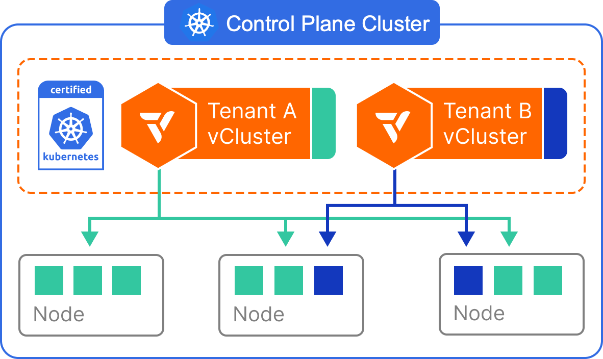
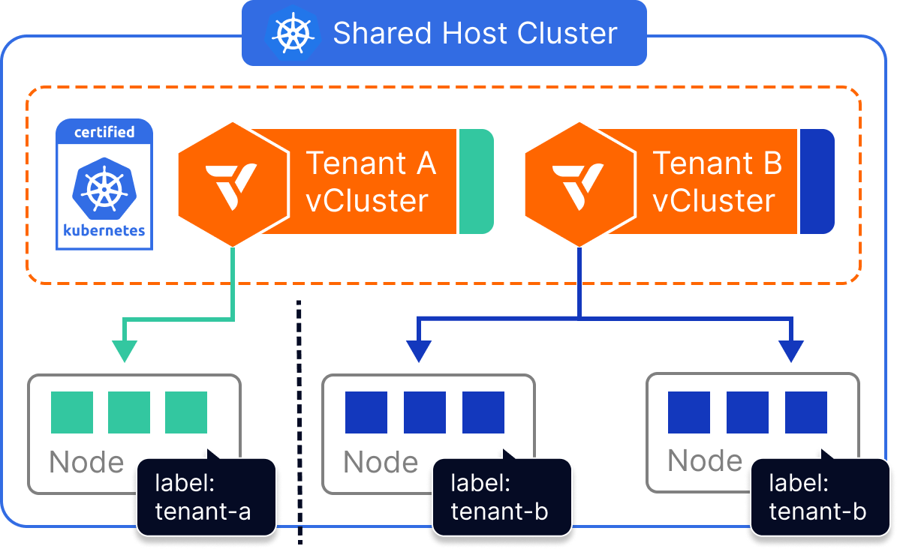
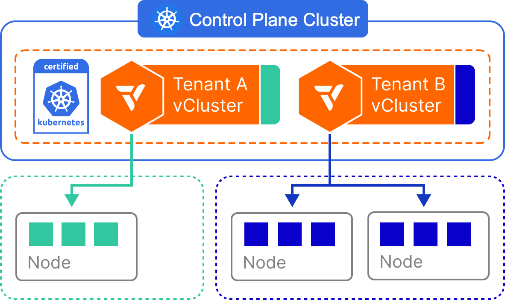
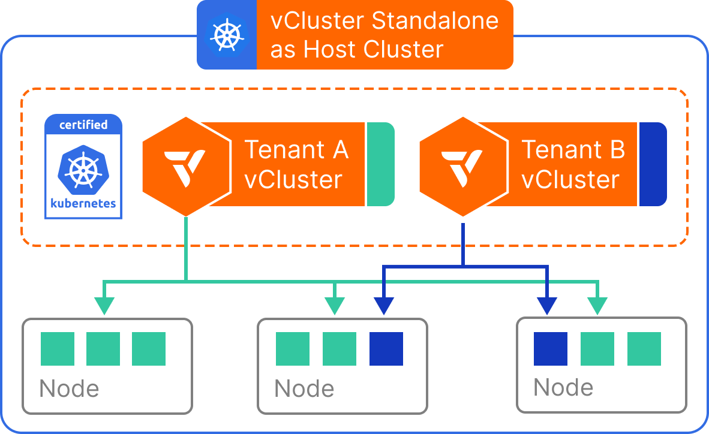
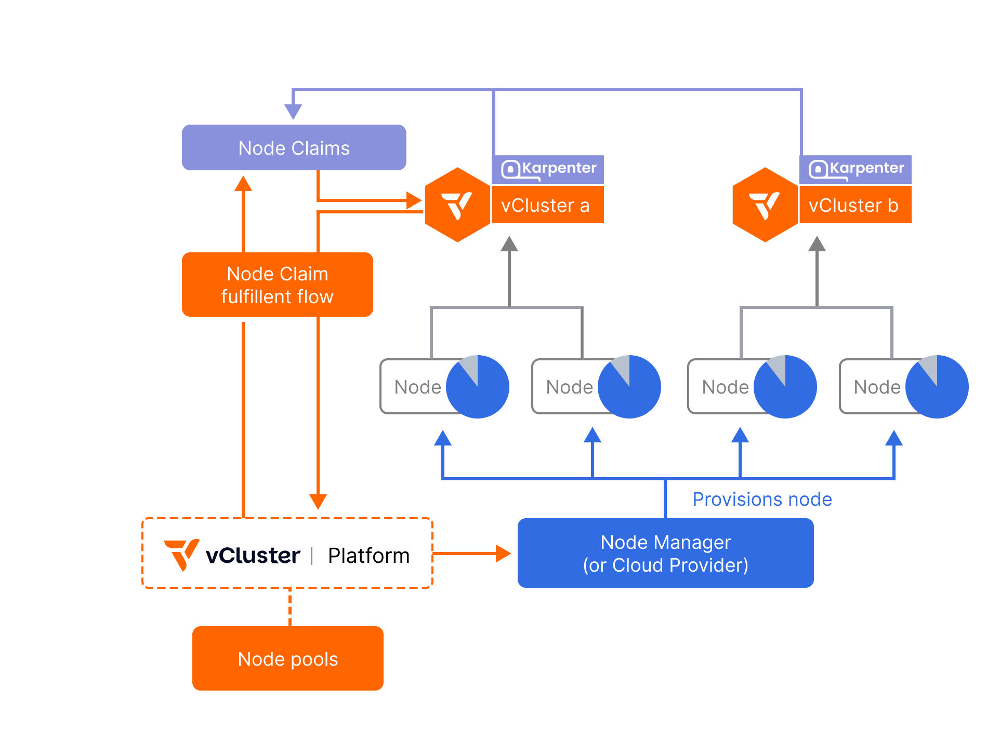

<div align="center">
  <a href="https://www.vcluster.com">
    <picture>
      <source media="(prefers-color-scheme: dark)" srcset="docs/static/media/vcluster_horizontal_orange_white.svg">
      <source media="(prefers-color-scheme: light)" srcset="docs/static/media/vcluster_horizontal_orange_black.svg">
      
    </picture>
  </a>
  <p><strong>Tenant Clusters for AI clouds, AI factories, and production Kubernetes</strong></p>
  <p><em>Run your infrastructure like a hyperscaler. Every team, customer, and training run gets its own isolated cluster.</em></p>

[](https://github.com/loft-sh/vcluster/stargazers)
[](https://slack.loft.sh/)
[](https://www.linkedin.com/company/vcluster)
[](https://x.com/vcluster)

**[Website](https://www.vcluster.com)** · **[Quickstart](https://www.vcluster.com/docs/get-started/)** · **[Documentation](https://www.vcluster.com/docs/)** · **[Blog](https://www.vcluster.com/blog)** · **[Slack](https://slack.loft.sh/)**

<br/>

<a href="https://www.cncf.io/training/certification/software-conformance/"></a>
&nbsp;&nbsp;&nbsp;&nbsp;
<a href="https://github.com/cncf/k8s-ai-conformance/tree/main/v1.35/vcluster-private-nodes"></a>

**CNCF Certified Kubernetes · Distribution** · **Kubernetes AI Conformant**

</div>

---

## About

**vCluster creates Tenant Clusters: fully isolated environments delivered as managed Kubernetes, or as the foundation for Slurm, Ray, Run:ai and inference clusters. Each gets its own API server, CRDs and RBAC, and runs on an existing cluster or standalone on bare metal. CNCF Certified Kubernetes.**

Every cluster becomes a product you can ship. Sell it to customers or serve it to internal teams from the same platform, with each tenant seeing only their own cluster and nothing else. The control plane stays invisible to tenants: no shared control plane nodes, no in-cluster agent pods, and no lateral path between environments.

Because a Tenant Cluster is upstream Kubernetes, everything built for the standard API works against it unmodified: `kubectl`, Helm, Argo, Crossplane, operators, and CRDs.

**40M+ Tenant Clusters deployed.** vCluster runs in production at Adobe, CoreWeave, NVIDIA, Nebius, Nscale, Lintasarta, Atlan, Deloitte, and across 50+ AI clouds and Fortune 500 platform organizations, powering 100K+ GPUs and 1M+ CPUs.

<div align="center">


</div>

---

## 🚀 Quick start

```bash
# Install the vCluster CLI
brew install loft-sh/tap/vcluster

# Create a Tenant Cluster
vcluster create my-vcluster --namespace team-x

# Use kubectl as usual. You are now inside your Tenant Cluster.
kubectl get namespaces
```

**Prerequisites:** a running Kubernetes cluster and `kubectl` configured.

👉 **[Full quickstart guide](https://www.vcluster.com/docs/get-started)**

### 🐳 Run locally on Docker with [vind](https://github.com/loft-sh/vind)

No Kubernetes cluster? Run a complete Tenant Cluster in Docker containers with **vind** (vCluster in Docker). Like `kind`, but with the full vCluster feature set: UI, sleep and resume, LoadBalancer, image cache, and external nodes joining over VPN.

```bash
vcluster create my-vcluster --driver docker
kubectl get namespaces
```

### 🎮 Try it in the browser

[](https://killercoda.com/vcluster)

### 🎁 vCluster free tier

Real usage, not a gated demo. Unlimited Tenant Clusters up to 64 CPUs and 32 GPUs, plus the full vCluster Platform UI, for free. **[Get started free →](https://www.vcluster.com/free)**

---

## 🧩 Every kind of cluster

One platform turns raw compute into the cluster type each tenant actually asks for. Kubernetes is the foundation; the rest are delivered on top of it.

| Cluster type | What a tenant gets |
|---|---|
| **Kubernetes Clusters** | A dedicated, CNCF-certified Kubernetes cluster with its own API server, CRDs, and RBAC |
| **Nested Clusters** | Tenant Clusters running on the Control Plane Cluster's shared nodes for maximum density |
| **Inference Clusters** | Serving stacks such as Dynamo and llm-d, isolated per tenant |
| **Ray Clusters** | Ray for distributed training and data processing, isolated per tenant |
| **Run:ai Clusters** | Run:ai scheduling on top of an isolated Tenant Cluster |
| **Slurm Clusters** *(Beta)* | Managed Slurm for HPC and batch training |
| **Agent Sandbox Clusters** *(Coming soon)* | Isolated clusters for agentic and untrusted code execution |

Slurm, Ray, Run:ai, inference, and agent sandbox clusters are delivered through **[vCluster Platform](https://www.vcluster.com/docs/)**. This repository is the open-source engine that every one of them is built on.

👉 **[See all cluster types](https://www.vcluster.com/)**

---

## 🏗️ Architectures

vCluster supports multiple deployment architectures. Two things vary independently: where the control plane runs (an existing Kubernetes cluster, a standalone binary, or Docker) and how tenant workloads are placed (shared nodes or private nodes). The modes below combine them, offering progressively stronger isolation from dense shared infrastructure through to fully standalone deployments on bare metal.

### Architecture comparison

| | **Shared Nodes** | **Dedicated Nodes** | **Private Nodes** | **Standalone** |
|---|:---:|:---:|:---:|:---:|
| **Control Plane Cluster** | Required | Required | Required | Not required |
| **Node isolation** | ❌ | ✅ | ✅ | ✅ |
| **CNI/CSI isolation** | ❌ | ❌ | ✅ | ✅ |
| **Bare metal ready** | · | · | ✅ | ✅ |
| **Best for** | Dev/test, density | Production tenants | Compliance, GPU | AI factories, edge |

👉 **[Full architecture guide](https://www.vcluster.com/docs/vcluster/introduction/architecture/)**

### Minimal configuration

<details>
<summary>🔹 Shared Nodes: maximum density, minimum cost</summary>
Tenant Clusters share the Control Plane Cluster's nodes. Workloads run as regular pods in a namespace.
<div align="center">

</div>

```yaml
sync:
  fromHost:
    nodes:
      enabled: false  # Uses pseudo nodes
```
</details>
<details>
<summary>🔹 Dedicated Nodes: isolated compute on labeled node pools</summary>
Tenant Clusters get their own set of labeled nodes on the Control Plane Cluster. Workloads are isolated but still managed by the Control Plane Cluster.
<div align="center">

</div>

```yaml
sync:
  fromHost:
    nodes:
      enabled: true
      selector:
        labels:
          tenant: my-tenant
```
</details>
<details>
<summary>🔹 Private Nodes <sup>v0.27+</sup>: full CNI/CSI isolation</summary>
External nodes join the Tenant Cluster directly with their own CNI, CSI, and networking stack, through a token-based process. No cross-tenant visibility, and complete infrastructure separation from the Control Plane Cluster. Nodes can also join over an encrypted VPN overlay <sup>v0.30+</sup>, so one Tenant Cluster can span sites, networks, and clouds.
<div align="center">

</div>

```yaml
privateNodes:
  enabled: true
controlPlane:
  service:
    spec:
      type: NodePort
```
</details>
<details>
<summary>🔹 vCluster Standalone <sup>v0.29+</sup>: no Control Plane Cluster required</summary>
A complete, zero-dependency Kubernetes distribution. Run the whole control plane as a self-contained binary directly on bare metal or VMs. This is how providers solve the "cluster one" problem when building infrastructure from scratch.
<div align="center">

</div>

```yaml
controlPlane:
  standalone:
    enabled: true
    joinNode:
      enabled: true
privateNodes:
  enabled: true
```
</details>
<details>
<summary>⚡ Auto Nodes <sup>v0.28+</sup>: Karpenter-powered dynamic autoscaling</summary>
Automatically provision and deprovision private nodes based on workload demand. Works across public cloud, private cloud, hybrid, and bare metal environments. Node profiles <sup>v0.36+</sup> let each pool carry its own node configuration.
<div align="center">

</div>

```yaml
autoNodes:
  enabled: true
  nodeProvider: <provider>
privateNodes:
  enabled: true
```
</details>
<details>
<summary>🐳 vind <sup>v0.32+</sup>: a complete Tenant Cluster in Docker, no Kubernetes required</summary>
The control plane and worker nodes run as containers on a single Docker host, using private nodes underneath. There is no Control Plane Cluster and no Kubernetes dependency at all, which makes this the fastest way to get a real Tenant Cluster on a laptop or a CI runner. Docker deployment is driven by the CLI rather than by <code>vcluster.yaml</code>.

```bash
vcluster create my-vcluster --driver docker
```
</details>

---

## ✨ Key features

| Feature | Description |
|---|---|
| **🎛️ Its own API server, per tenant** | Every Tenant Cluster runs a dedicated control plane: API server, controller manager, and data store. Full Kubernetes API isolation, not a namespace with rules layered on top |
| **🔒 Strong tenant isolation** | Tenants hold admin inside their Tenant Cluster while holding minimal permissions on the Control Plane Cluster |
| **🎮 GPU-aware scheduling** | Dynamic Resource Allocation with resource claims, resource claim templates, and device classes, plus in-place pod resizing |
| **⚡ Auto Nodes** | Karpenter-powered provisioning and deprovisioning of private nodes across cloud, hybrid, and bare metal, with per-pool node profiles |
| **🖥️ Standalone deployment** | Run without a Control Plane Cluster on dedicated infrastructure or bare metal, purpose-built for AI factories and on-prem GPU fleets |
| **🐳 Runs on Docker** | A complete Tenant Cluster in Docker containers with no Kubernetes dependency, through `vcluster create --driver docker` |
| **🔐 Node VPN** *(Platform)* | Private nodes join over an encrypted overlay, so a single Tenant Cluster can span sites, networks, and clouds |
| **📸 Snapshot and restore** | Snapshot a Tenant Cluster to S3, OCI, Azure Blob, or local storage, and restore it elsewhere |
| **💤 Sleep mode** *(Platform)* | Pause inactive Tenant Clusters to save resources, with instant wake when needed |
| **🔗 Shared platform stack** *(Shared / Dedicated Nodes)* | Reuse the Control Plane Cluster's CNI, CSI, ingress, and other infrastructure, with no duplicate platform components |
| **🔄 Resource syncing** *(Shared / Dedicated Nodes)* | Bidirectional sync of any Kubernetes resource: pods, services, secrets, configmaps, CRDs, and Gateway API objects |
| **🧩 Integrations** | Native support for cert-manager, external-secrets, KubeVirt, Istio, and metrics-server |
| **📊 High availability** | Multiple replicas with leader election. Embedded etcd or external databases (PostgreSQL, MySQL, RDS) |

> Shared platform stack, resource syncing, and Control Plane Cluster integrations apply in **Shared** and **Dedicated Nodes** modes, where the Tenant Cluster reuses the Control Plane Cluster's CNI, CSI, and platform stack. **Private Nodes** and **Standalone** deployments bring their own CNI, CSI, and platform components.

---

## 🆕 What's new

| Version | Feature | Description |
|---|---|---|
| **v0.36** | [Gateway API and node profiles](https://github.com/loft-sh/vcluster/releases/tag/v0.36.0) | Gateway API sync for Tenant Clusters, node profiles for private nodes, and a pinnable standalone advertise address |
| **v0.35** | [Snapshots and Kubernetes 1.36](https://github.com/loft-sh/vcluster/releases/tag/v0.35.0) | etcd v3 snapshot facilities for embedded etcd, wildcard custom resource proxy, kine metrics, Kubernetes v1.36 |
| **v0.34** | [Multi-region platform and standalone snapshots](https://www.vcluster.com/releases/changelog/vcluster-platform-v49-vcluster-v034-multi-region-platform-snapshot-support) | Active/active vCluster Platform across regions (Route 53 + RDS), standalone snapshots (S3 / OCI / local), first-class template parameters |
| **v0.33** | [Enterprise reliability and storage](https://github.com/loft-sh/vcluster/releases/tag/v0.33.0) | Automatic leaf-cert regeneration, Azure Blob snapshot destinations, workload-level sleep annotations |
| **v0.32** | [Docker driver and DRA](https://github.com/loft-sh/vcluster/releases/tag/v0.32.0) | Run vCluster on Docker, Dynamic Resource Allocation (DRA) for GPU workloads, in-place pod resizing |
| **v0.27–v0.31** | [Architecture foundations](https://www.vcluster.com/docs/vcluster/introduction/architecture/) | [Private Nodes](https://www.vcluster.com/docs/vcluster/deploy/worker-nodes/private-nodes) (v0.27), [Auto Nodes](https://www.vcluster.com/docs/vcluster/deploy/worker-nodes/private-nodes/auto-nodes/) (v0.28), [Standalone](https://www.vcluster.com/docs/vcluster/deploy/control-plane/binary/) (v0.29), vCluster VPN and Netris (v0.30), snapshot and cross-cluster APIs (v0.31) |

👉 **[Full changelog](https://www.vcluster.com/releases)**

---

## 🎯 Who runs vCluster

| Use case | What it solves | Learn more |
|---|---|---|
| **AI cloud providers** | Launch a hyperscaler-like managed cluster experience for GPU customers. Automate tenant, cluster, and bare metal provisioning end to end. | [View →](https://www.vcluster.com/solutions/gpu-cloud-providers) |
| **AI factories** | Run AI on-prem where your data and GPUs live. Give every team the GPU access they need without multiplying infrastructure. | [View →](https://www.vcluster.com/solutions/ai-factory) |
| **Internal GPU platforms** | Maximize GPU utilization without sacrificing isolation. Self-service Kubernetes for AI/ML teams. | [View →](https://www.vcluster.com/solutions/internal-gpu-platform) |
| **Distributed inference** | Isolated, production-grade serving stacks per tenant, per model, or per customer. | [View →](https://www.vcluster.com/solutions/distributed-inference) |
| **Sovereign clouds** | Data residency and tenant isolation enforced at the infrastructure layer. | [View →](https://www.vcluster.com/solutions/sovereign-clouds) |
| **Bare metal Kubernetes** | Run production Kubernetes on bare metal with zero VMs. Isolation without virtualization overhead. | [View →](https://www.vcluster.com/solutions/bare-metal-kubernetes) |
| **Software vendors** | Ship Kubernetes-native products. Each customer gets their own isolated Tenant Cluster. | [View →](https://www.vcluster.com/solutions/software-vendors) |
| **Environments and cost savings** | Consolidate clusters, pause idle workloads with sleep mode, and cut Kubernetes cost at scale. | [View →](https://www.vcluster.com/cost-savings) |

Start turnkey with the vCluster Platform UI and CLI, or call the APIs and put your own portal and brand in front. It is a two-way door, with no re-platforming.

---

## 🌐 The vCluster stack

vCluster is the foundation of a broader platform for running Kubernetes and AI infrastructure on your own hardware, from a single rack to 100K-GPU superclusters.

| Product | What it does |
|---|---|
| **[vCluster](https://www.vcluster.com)** | Tenant Clusters. A dedicated control plane per tenant, with API, data, and optionally network isolation |
| **[vNode](https://www.vnode.com/)** | Runtime-level isolation. Kernel-enforced boundaries (Linux user namespaces, seccomp, cgroups, AppArmor) without VM overhead |
| **[vMetal](https://www.vmetal.ai/)** | Bare metal provisioning and lifecycle for GPU fleets. Turns GPU racks into a cloud platform |
| **[Netris](https://www.vcluster.com/solutions/netris-kubernetes-network-automation)** *(integration)* | Hardware-enforced network isolation via programmatic VLANs, VRFs, and ACLs |

Together they provide the full stack for an AI factory: certified Kubernetes, isolated Tenant Clusters, runtime workload sandboxing, and GPU infrastructure operations. The **ClusterMAX™** security criteria call for strong isolation between tenants, and name vNode Private Nodes.

---

## 🏢 Trusted by

<table>
<tr>
<td align="center"><a href="https://www.vcluster.com/case-studies/nebius"><strong>Nebius</strong></a><br/>AI cloud tenant isolation</td>
<td align="center"><a href="https://www.vcluster.com/case-studies/qumulusai"><strong>QumulusAI</strong></a><br/>1 min to spin up isolated K8s</td>
<td align="center"><a href="https://www.vcluster.com/case-studies/polarise"><strong>Polarise</strong></a><br/>100% data residency at the infra layer</td>
</tr>
<tr>
<td align="center"><a href="https://www.vcluster.com/case-studies/boost-run"><strong>Boost-Run</strong></a><br/>&lt;45 days to production launch</td>
<td align="center"><a href="https://www.vcluster.com/case-studies/lintasarta"><strong>Lintasarta</strong></a><br/>170+ Tenant Clusters in production</td>
<td align="center"><a href="https://www.vcluster.com/case-studies/nscale"><strong>Nscale</strong></a><br/>Kubernetes platforms on bare metal</td>
</tr>
<tr>
<td align="center"><a href="https://www.vcluster.com/case-studies/coreweave"><strong>CoreWeave</strong></a><br/>GPU cloud at scale</td>
<td align="center"><a href="https://www.vcluster.com/case-studies/atlan"><strong>Atlan</strong></a><br/>100 → 1 clusters</td>
<td align="center"><a href="https://www.vcluster.com/case-studies/fortune-500-insurance-company"><strong>Fortune 500 Insurance</strong></a><br/>70% reduction in Kubernetes cost</td>
</tr>
<tr>
<td align="center"><a href="https://www.vcluster.com/case-studies/deloitte"><strong>Deloitte</strong></a><br/>Enterprise Kubernetes platform</td>
<td align="center"><a href="https://www.vcluster.com/case-studies/aussie-broadband"><strong>Aussie Broadband</strong></a><br/>99% faster provisioning</td>
<td align="center"><a href="https://www.vcluster.com/case-studies/ada-cx"><strong>Ada</strong></a><br/>10x developer productivity</td>
</tr>
</table>

**Also used by:** Adobe, NVIDIA, ABBYY, Precisely, Shipwire, and many more, with 50+ GPU clouds and Fortune 500s running vCluster in production.

👉 **[View all case studies](https://www.vcluster.com/case-studies)**

---

## 📚 Learn more

<details>
<summary><strong>🎤 Conference talks</strong></summary>

| Event | Speaker | Title | Link |
|---|---|---|---|
| NVIDIA GTC 2026 | Lukas Gentele | Build a Software-Defined Multi-Tenant NVLinked Cluster | [Watch](https://www.nvidia.com/en-us/on-demand/session/gtc26-s81640/) |
| KubeCon NA 2025 (Keynote) | Lukas Gentele | Autoscaling GPU Clusters Anywhere | [Watch](https://www.youtube.com/watch?v=LGOELO-ah30) |
| Platform Engineering Day NA 2025 (Keynote) | Saiyam Pathak | AI-Ready Platforms: Scaling Teams Without Scaling Costs | [Watch](https://www.youtube.com/watch?v=sn5kIBS9Xfg) |
| Rejekts NA 2025 | Hrittik Roy, Saiyam Pathak | Beyond the Default Scheduler: Navigating GPU MultiTenancy in AI Era | [Watch](https://www.youtube.com/watch?v=tROp-nmNYxo) |
| KubeCon EU 2025 | Paco Xu, Saiyam Pathak | A Huge Cluster or Multi-Clusters? Identifying the Bottleneck | [Watch](https://www.youtube.com/watch?v=6l5zCt5QsdY) |
| HashiConf 2025 | Scott McAllister | GPU sharing done right: Secrets, security, and scaling with Vault and vCluster | [Watch](https://www.youtube.com/watch?v=zWx17azSqyU) |
| FOSDEM 2025 | Hrittik Roy, Saiyam Pathak | Accelerating CI Pipelines: Rapid Kubernetes Testing with vCluster | [Watch](https://archive.fosdem.org/2025/schedule/event/fosdem-2025-5569-accelerating-ci-pipelines-rapid-kubernetes-testing-with-vcluster/) |
| KubeCon India 2024 (Keynote) | Saiyam Pathak | From Outage To Observability: Lessons From a Kubernetes Meltdown | [Watch](https://www.youtube.com/watch?v=7JCZ688cWpY) |
| CNCF Book Club 2024 | Marc Boorshtein | Kubernetes: An Enterprise Guide (vCluster) | [Watch](https://www.youtube.com/watch?v=8vwnDlkkuJM) |
| KCD NYC 2024 | Lukas Gentele | Tenant Autonomy & Isolation In Multi-Tenant Kubernetes Clusters | [Watch](https://www.youtube.com/watch?v=AKJVLbXsUmE) |
| KubeCon EU 2023 | Ilia Medvedev, Kostis Kapelonis | How We Securely Scaled Multi-Tenancy with VCluster, Crossplane, and Argo CD | [Watch](https://www.youtube.com/watch?v=hFiHU6W4_z0) |
| KubeCon NA 2022 | Joseph Sandoval, Dan Garfield | How Adobe Planned For Scale With Argo CD, Cluster API, And VCluster | [Watch](https://www.youtube.com/watch?v=p8BluR5WT5w) |
| KubeCon NA 2022 | Whitney Lee, Mauricio Salatino | What a RUSH! Let's Deploy Straight to Production! | [Watch](https://www.youtube.com/watch?v=eJG7uIU9NpM) |
| TGI Kubernetes 2022 | TGI | TGI Kubernetes 188: vCluster | [Watch](https://www.youtube.com/watch?v=EaoxUDGpARE) |
| Mirantis Tech Talks 2022 | Mirantis | Multi-tenancy & Isolation using Virtual Clusters (vCluster) in K8s | [Watch](https://www.youtube.com/watch?v=CoqRXdJbCwY) |
| Solo Webinar 2022 | Rich Burroughs, Fabian Keller | Speed your Istio development environment with vCluster | [Watch](https://www.youtube.com/watch?v=b7OkYjvLf4Y) |
| KubeCon NA 2021 | Lukas Gentele | Beyond Namespaces: Virtual Clusters are the Future of Multi-Tenancy | [Watch](https://www.youtube.com/watch?v=QddWNqchD9I) |

</details>

<details>
<summary><strong>🎬 Community voice</strong></summary>

| Channel | Speaker | Title | Link |
|---|---|---|---|
| TeKanAid 2024 | TeKanAid | Getting Started with vCluster: Build Your IDP with Backstage, Crossplane, and ArgoCD | [Watch](https://www.youtube.com/watch?v=nIxl2PcEs-0) |
| Rawkode 2021 | David McKay, Lukas Gentele | Hands on Introduction to vCluster | [Watch](https://www.youtube.com/watch?v=IMdMvn2_LeI) |
| Kubesimplify 2021 | Saiyam Pathak, Lukas Gentele | Let's Learn vCluster | [Watch](https://www.youtube.com/watch?v=I4mztvnRCjs) |
| TechWorld with Nana 2021 | Nana | Build your Self-Service Kubernetes Platform with Virtual Clusters | [Watch](https://www.youtube.com/watch?v=tt7hope6zU0) |
| DevOps Toolkit 2021 | Viktor Farcic | How To Create Virtual Kubernetes Clusters | [Watch](https://www.youtube.com/watch?v=JqBjpvp268Y) |

</details>

**Featured in 4 books** on Kubernetes and platform engineering.

👉 **[YouTube channel](https://www.youtube.com/@vcluster)** · **[Blog](https://www.vcluster.com/blog)** · **[Resources](https://www.vcluster.com/resources)**

---

## 🤝 Contributing

We welcome contributions. Check out the **[contributing guide](https://github.com/loft-sh/vcluster/blob/main/CONTRIBUTING.md)** to get started.

---

## 💬 Connect with us

- Join our [Slack community](https://slack.loft.sh/), 5K+ engineers
- Follow on [LinkedIn](https://www.linkedin.com/company/vcluster), 28K+
- Follow on [X](https://x.com/vcluster), 3.7K+
- Watch on [YouTube](https://www.youtube.com/@vcluster)
- Read the [blog](https://www.vcluster.com/blog)
- Book a [consultation](https://start-chat.com/slack/Loft-Labs/NnQl1M)

---

## 📜 License

vCluster is licensed under the **[Apache 2.0 License](http://www.apache.org/licenses/LICENSE-2.0)**.

---

<div align="center">

**© 2026 [vCluster Labs](https://www.vcluster.com). All rights reserved.**

Made with ❤️ by the vCluster community.

⭐ **Star us on GitHub.** It helps.

</div>
